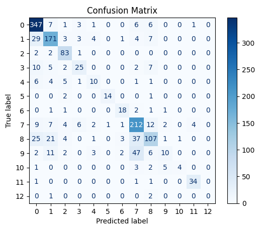

# Vertical LLM in Legal Domain

## Introduction

Verticalization refers to specializing a general-purpose LM for a specific domain or task. Vertical LLMs aim to overcome the limitations of general models in specific contexts. In this experiment, `legal-bert-base-uncased` model , which is vertically pre-trained on English legal data, is fine-tuned and evaluated on `scotus` dataset of LexGLUE benchmark.

</br>

## Getting Started

Python 3 is required to run the scripts.

### Installation

> Following packages are required to be installed:
> - transformers
> - datasets
> - evaluate
> - torch
> - numpy

```
pip install transformers datasets torch numpy evaluate
```
</br>

## LEGAL-BERT

[Legal-BERT](https://huggingface.co/nlpaueb/legal-bert-base-uncased) is a family of BERT models for the legal domain. BERT is pre-trained on various legal corpora: EU legislation, various court cases and US contracts, etc.

</br>

## LexGLUE

[LexGLUE](https://huggingface.co/datasets/coastalcph/lex_glue) is a benchmark dataset for legal NLP tasks (Chalkidis et al., 2022). It consists of seven existing legal NLP datasets:

| Dataset  | Sub-domain | Task Type |
| -------  | ---------- | --------- |
| ecthr_a  | European Court of Human Rights | Multi-label classification |
| ecthr_b  | European Court of Human Rights | Multi-label classification |
| scotus   | US Law - US Supreme Court cases | Multi-label classification |
| eurlex   | EU legislation | Multi-label classification |
| ledgar   | Contract provisions from US Securities and Exchange Commission | Multi-label classification |
| unfair_tos  | Terms of Service - unfair contractual terms | Multi-label classification |
| case_hold  | US court cases from the Harvard Law Library case law corpus | Multiple Choice QA |
</br>

Results according to Chalkidis et al. (2022):
| Dataset  | scotus |
| -------  | ------- |
| Model    | micro-f1 / macro-f1 |
| BERT     | 68.3 / 58.3 |
| RoBERTa  | 71.6 / 62.0 |
| Legal-BERT | **76.4** / **66.5** |

</br>

## Experiments

*Experimental Set Up* based on Chalkidis et al. (2022):
* learning rate = 3e-5
* batch size = 8
* weight decay = 0.06
* epoch = 3 (due to lack of GPU, Legal-BERT was fine-tuned only for 3 epochs in this experiment)

</br>

> Fine-tuned model is saved under `fine_tuned_legal_agent` directory.

</br>

### Evaluation
_________
> Following packages are required to be installed:
> - sklearn
> - pandas
> - torch

| Epoch | Training Loss | Validation Loss | Accuracy | F1 | Precision | Recall |
| ----- | ------------- | --------------- | -------- | -- | --------- | ------ |
| 1	| 1.212700 | 0.971134 | 0.701429 | 0.668593 | 0.695071 | 0.701429 |
| 2 | 0.680500 | 0.979275 | 0.735714 | 0.710385 | 0.713011 | 0.735714 |
| 3	| 0.457500 | 1.055988 | 0.739286 | 0.717577	| 0.724347 | 0.739286 |
</br>

Confusion Matrix :

</br>

Result on `scotus` dataset:
| Metric | Score |
|:-------|---------:|
| F1 Score (Micro) | **0.739286** |
| F1 Score (Macro) | **0.606073** |


## Future Work

Since legal-oriented language model like Legal-BERT performs overall better than BERT model, larger language models (e.g. RoBERTa) that are vertically pre-trained / fine-tuned on legal data will gain more critical in-domain (legal) knowledge.
